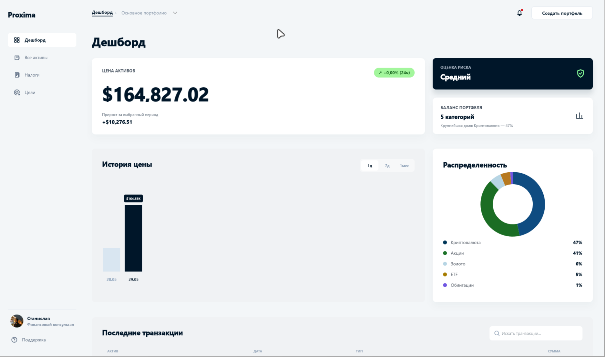
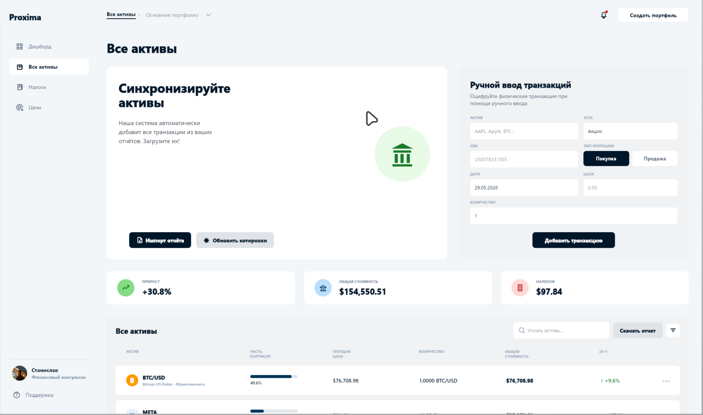
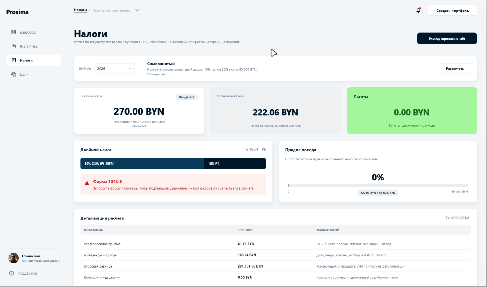
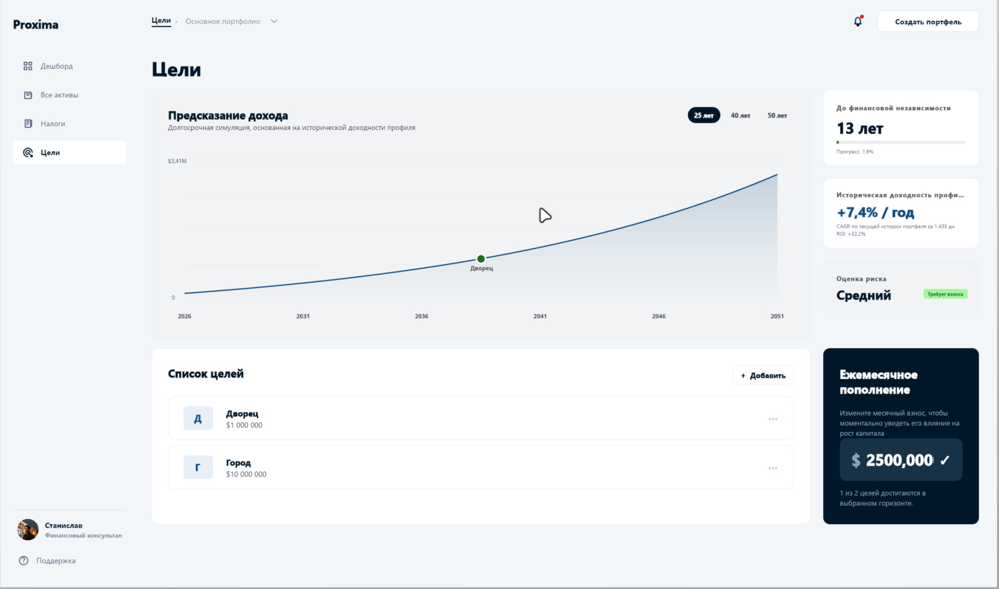
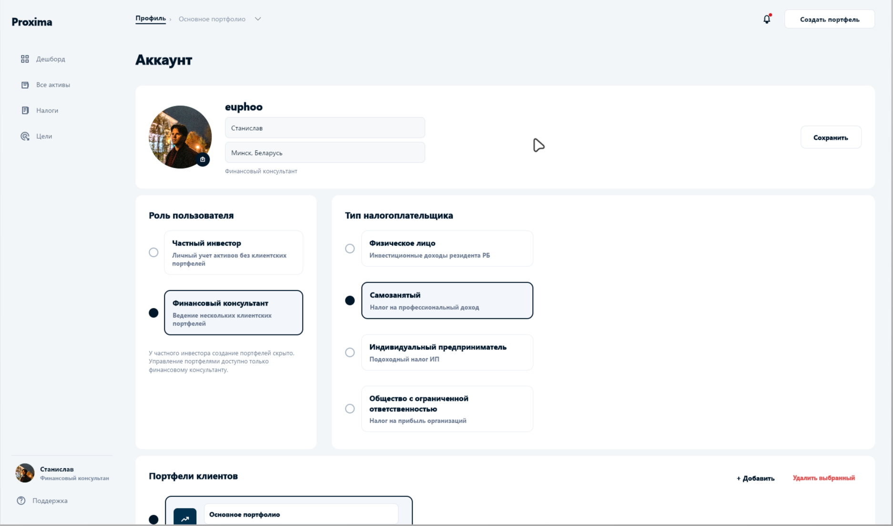
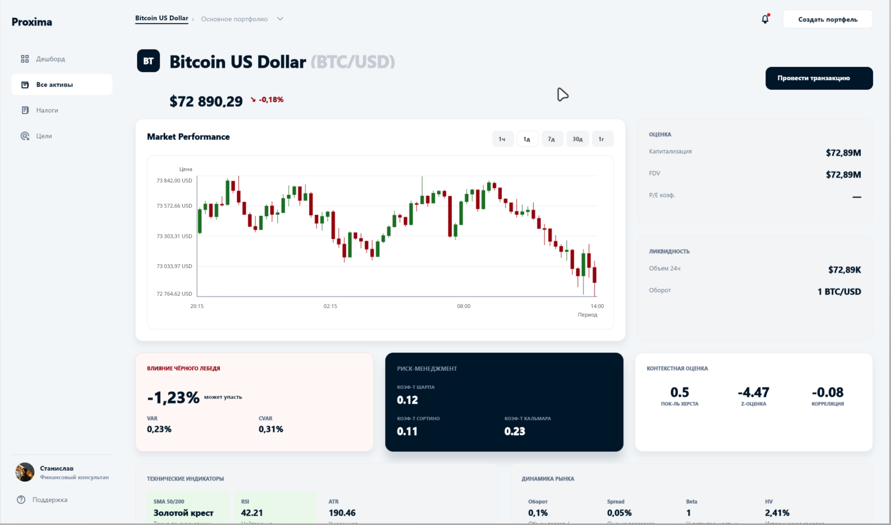
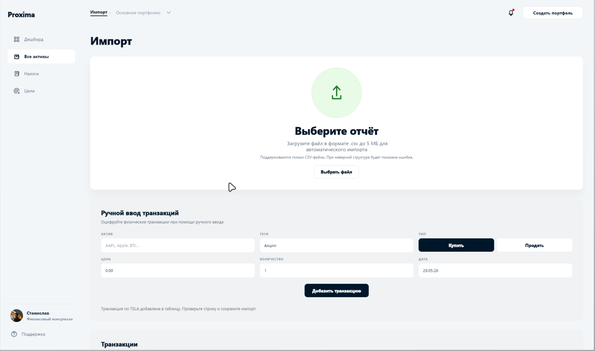
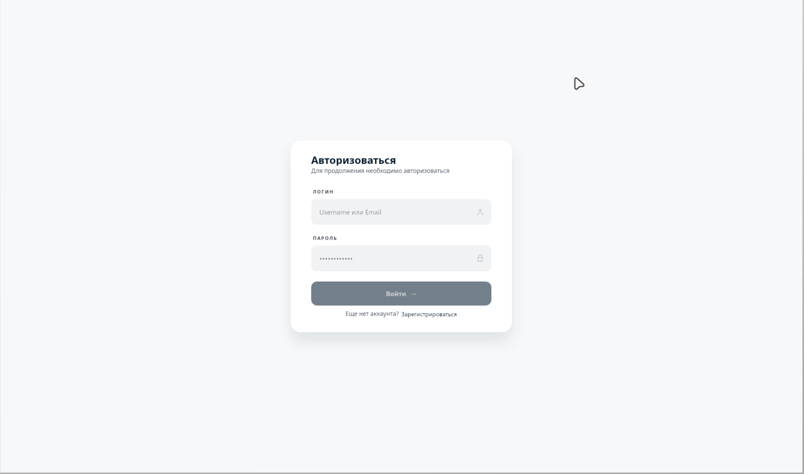

# Proxima

Proxima is a desktop portfolio management application built with .NET and Avalonia. It tracks assets, transactions, goals, taxes, notifications, market data, imports, and PDF reports using a compact layered architecture.

## Features

- Local user registration and password-based authentication
- Portfolio, asset, transaction, and goal management
- Dashboard analytics for allocation, performance, risk, and recent activity
- CSV transaction import with preview and validation
- Twelve Data integration for symbol lookup, quotes, and asset market data
- Tax and exchange-rate workflows
- PDF portfolio report generation
- PostgreSQL persistence with EF Core migrations

## Screenshots

<p align="center">
  
</p>

<table>
  <tr>
    <td width="50%">
      
      <br>
      <sub><strong>Assets</strong> - import reports, refresh quotes, and manage transactions.</sub>
    </td>
    <td width="50%">
      
      <br>
      <sub><strong>Taxes</strong> - calculate tax exposure with exchange-rate and profile context.</sub>
    </td>
  </tr>
  <tr>
    <td width="50%">
      
      <br>
      <sub><strong>Goals</strong> - model long-term targets and contribution scenarios.</sub>
    </td>
    <td width="50%">
      
      <br>
      <sub><strong>Profile</strong> - configure account role, tax profile, and managed portfolios.</sub>
    </td>
  </tr>
  <tr>
    <td width="50%">
      
      <br>
      <sub><strong>Asset Details</strong> - review price action, liquidity, risk, and technical indicators.</sub>
    </td>
    <td width="50%">
      
      <br>
      <sub><strong>Import</strong> - upload CSV reports or enter transactions manually.</sub>
    </td>
  </tr>
</table>

<p align="center">
  
  <br>
  <sub>Minimal local sign-in flow.</sub>
</p>

## Architecture

<p align="center">
  
</p>

## Data Model

<p align="center">
  
</p>

More diagrams, including use cases, domain classes, import flow, and tax sequence, are available in [`docs/`](docs/).

## Solution Structure

```text
src/
  Proxima.App/             Avalonia desktop UI, shell, views, view models, design system
  Proxima.Core/            Domain models and application services
  Proxima.Infrastructure/  PostgreSQL, repositories, imports, market data, reports, auth
tests/
  Proxima.Tests/           Lightweight executable test suite
```

`Proxima.Core` intentionally has no dependency on Avalonia, EF Core, Npgsql, PdfSharp, or infrastructure code. `Proxima.Infrastructure` depends on Core, and `Proxima.App` composes Core and Infrastructure.

## Requirements

- .NET SDK 10.0 or newer
- Docker or another local PostgreSQL 16-compatible instance
- Optional: Twelve Data API key for live market data

## Getting Started

Start the local PostgreSQL database:

```bash
docker compose up -d
```

Restore and build the solution:

```bash
dotnet restore Proxima.sln
dotnet build Proxima.sln
```

Run the desktop app:

```bash
dotnet run --project src/Proxima.App/Proxima.App.csproj
```

On first launch, create a local profile. The app applies EF Core migrations automatically during startup.

## Configuration

By default, Proxima connects to the PostgreSQL service from `docker-compose.yml`:

```text
Host=localhost;Port=55432;Database=proxima;Username=proxima;Password=proxima
```

Supported environment variables:

| Variable | Purpose |
| --- | --- |
| `PROXIMA_DB_CONNECTION` | Overrides the PostgreSQL connection string. |
| `PROXIMA_DB_SEED=true` | Enables demo seed data during database bootstrap. |
| `PROXIMA_DEV_AUTOLOGIN_LOGIN` | Login used by development auto-login. |
| `PROXIMA_DEV_AUTOLOGIN_PASSWORD` | Password used by development auto-login. |

Twelve Data API keys are configured inside the app profile/settings flow.

## Tests

Run the test project:

```bash
dotnet run --project tests/Proxima.Tests/Proxima.Tests.csproj
```

The tests validate the project graph, Core dependency boundaries, EF model shape, password hashing, analytics, CSV import preview, and PDF report generation.

## Database

The EF Core context and migrations live in `src/Proxima.Infrastructure/Persistence`. The design-time context factory uses the same `PROXIMA_DB_CONNECTION` fallback as the application.

To stop the local database:

```bash
docker compose down
```

To remove persisted local PostgreSQL data as well:

```bash
docker compose down -v
```

## Packaging Helper

`prepare-project.sh` creates a `.tar.zst` archive of the repository while excluding build outputs, IDE folders, caches, logs, and other generated files:

```bash
./prepare-project.sh .
```

Set `REMOVE_SRC=1` to exclude the `src` directory from the archive.
